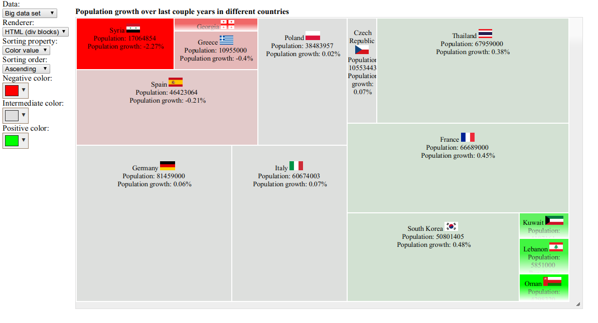

# treemap.js
A simple treemap graph rendering library written in ES6.



## Usage:

Let's start with a quick example. If you have jQuery library included in your project, the easiest way is to use treemap.js as plugin:
```javascript
$("#treemap-container").treemap(config);
```

where config is a configuration structure, prepared for treemap plugin. Generally, config consists of: data to render, rendering configuration and renderer type.
```javascript
    var config = {
        data: input,
        treemapConfig: config,
        render: "html",
      };
```  
Let's take a closer look to each section of config. 

**data** is an array with input data. There are two basic parameters necessary for 
rendering - *sizeValue* and *colorValue*. Logically, on *sizeValue* depends size of rectangle. *colorValue* is a bit trickier parameter -
it defines the color that should have rectangle (colors range is configurable). Technically, it is a Number value in any range (negative and positive)
where the min and max *colorValue*s from input data are treated as worst and best colors respectively.
```javascript
var input = [{
  sizeValue: 4298320,
  colorValue: 8.45
},
{
  sizeValue: 5851000,
  colorValue: 5.99
}];
```

**treemapConfig** controls additional chart rendering parameters:
```javascript
var config = {
  sortProperty: "colorValue",
  sortOrder: "asc",
  colorBounds: [
    "rgb(255, 0, 0)",
    "rgb(122, 122, 122)",
    "rgb(0, 255, 0)"
  ]
};
```

*sortProperty* - either colorValue or sizeValue. Defines which property should be used for sort. 
If value is not defined - library will take order from input array.

*sortOrder* - either "asc" or "dsc", ascending and descending sorting respectively.

*colorBounds* - colors range is used by library for interpreting *colorValue*. Min *colorValue* from input data array
corresponds to the first color from colorBounds arrray - in this example red, "rgb(255, 0, 0)". Max *colorValue* 
corresponds to the last color, "rgb(0, 255, 0)". As well, you can specify intermediate color used during interpolation.

**render** defines render to be used. Right now library has two built-in renderers - "html" and "canvas". 

## Example:

More usage examples you can find on [Example page](example.html).
